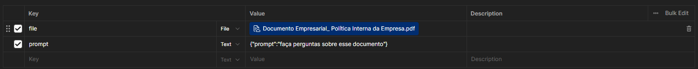
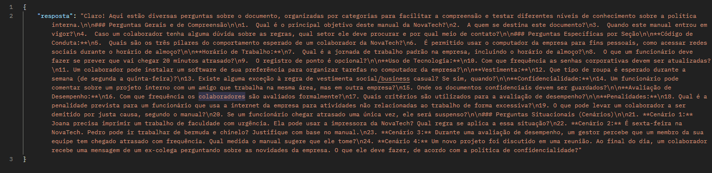

# Passos para iniciar o BackEnd

1. Instale e inicie o ambiente virtual
2. instale as bibliotecas manualmente ou com o requirements
    ```pip install -r requirements.txt```
3. inicie o BackEnd com ```uvicorn app:app```
4. coloque a url no Postman e no form-data coloque o pdf e o prompt.
5. defina as chaves dos parâmetros key | Value como esta na imagem.



## Sua resposta deve ser algo como:
